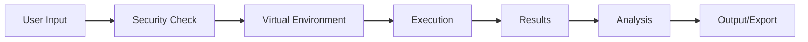
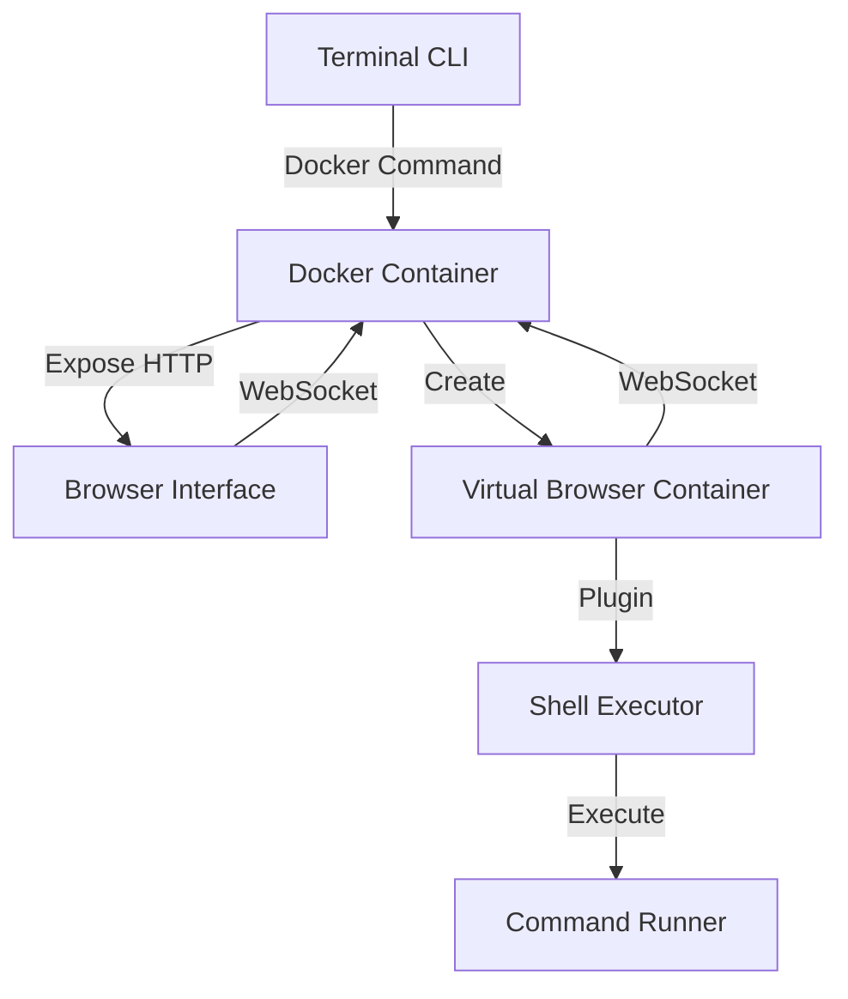

# www
www.browshell.com


# Browshell Value Proposition

## Browshell Value Proposition
Główna Propozycja Wartości

"Browshell to bezpieczne środowisko wykonawcze, które pozwala na natychmiastowe testowanie i uruchamianie kodu z treści webowych w izolowanym kontenerze, bezpośrednio z przeglądarki."

## Kluczowe Korzyści dla Użytkowników

### 1. Bezpieczeństwo Bez Kompromisów
- **Problem**: Ryzyko wykonania szkodliwego kodu z niepewnych źródeł
- **Rozwiązanie**:
    + Izolowane środowisko Docker
    + Automatyczna analiza bezpieczeństwa
    + Sandboxing każdego wykonania
- **Wartość**: Pewność bezpiecznego testowania dowolnego kodu

### 2. Natychmiastowa Dostępność
- **Problem**: Czasochłonne tworzenie środowisk testowych
- **Rozwiązanie**:
    + Jedno polecenie do uruchomienia (`browshell start`)
    + Automatyczna konfiguracja środowiska
    + Dostęp przez przeglądarkę
- **Wartość**: Oszczędność czasu i zasobów

### 3. Integracja z Workflow
- **Problem**: Rozbicie procesu między różne narzędzia
- **Rozwiązanie**:
    + Plugin przeglądarkowy
    + Integracja z treścią webową
    + Automatyczne wykrywanie kodu
- **Wartość**: Płynny proces pracy bez przełączania kontekstu

## Unikalne Cechy (Differentiators)

### 1. Kontekstowe Wykonanie

- Automatyczne wykrywanie kodu w treści
- Kontekstowa analiza zależności
- Natychmiastowe wyniki w przeglądarce

### 2. Intelligent Setup
- Automatyczna detekcja wymagań
- Dynamiczne tworzenie środowiska
- Smart dependency management

### 3. Universal Access
- Dostęp przez przeglądarkę
- Brak lokalnych instalacji (poza CLI)
- Cross-platform compatibility

## Korzyści dla Różnych Grup

### 1. Developers
```yaml
Korzyści:
  - Szybkie testowanie snippetów
  - Bezpieczne środowisko dev
  - Integracja z AI tools
  
Oszczędności:
  - Czas: 80% szybsze testowanie
  - Zasoby: Brak potrzeby lokalnych środowisk
  - Ryzyko: Eliminacja zagrożeń bezpieczeństwa
```

### 2. DevOps/SysAdmins
```yaml
Korzyści:
  - Izolowane testowanie skryptów
  - Automatyzacja środowisk
  - Kontrola zasobów
  
Oszczędności:
  - Infrastruktura: Zoptymalizowane użycie
  - Czas: Automatyczna konfiguracja
  - Bezpieczeństwo: Kontrolowane wykonanie
```

### 3. Security Teams
```yaml
Korzyści:
  - Pełna izolacja kodu
  - Audyt wykonań
  - Kontrola dostępu
  
Oszczędności:
  - Ryzyko: Minimalizacja zagrożeń
  - Czas: Automatyczna analiza
  - Zasoby: Centralne zarządzanie
```

## ROI (Return on Investment)

### 1. Oszczędność Czasu
```
Standardowy Process: 30 min setup + 15 min/test
Browshell: 1 min setup + 1 min/test

Miesięczne Oszczędności:
- 20 testów × 43 min = 14.3 godzin
- Wartość: ~$715 (przy $50/h)
```

### 2. Redukcja Ryzyka
```
Standardowe Ryzyko:
- Wykonanie złośliwego kodu
- Uszkodzenie systemu
- Wyciek danych

Browshell Zabezpieczenia:
- Izolacja: 100%
- Analiza: Automatyczna
- Audyt: Pełny
```

### 3. Produktywność
```
Usprawnienia:
- 80% szybsze testowanie
- 90% redukcja setup time
- 100% eliminacja ryzyka
```

## Competitive Advantage

1. **Versus Local Development**
    - Brak konfiguracji lokalnej
    - Izolacja środowiska
    - Automatyczna analiza bezpieczeństwa

2. **Versus Cloud IDEs**
    - Lżejsze rozwiązanie
    - Skupione na testowaniu
    - Integracja z treścią web

3. **Versus Sandboxes**
    - Pełna integracja z przeglądarką
    - Automatyczna detekcja kodu
    - Kontekstowe wykonanie

## Long-term Value

1. **Skalowalność**
    - Od pojedynczego developera do zespołów
    - Od prostych testów do złożonych środowisk
    - Od lokalnego użycia do enterprise

2. **Rozszerzalność**
    - Plugin system
    - API integracji
    - Custom environments

3. **Adaptability**
    - Nowe języki i frameworki
    - Integracje z nowymi narzędziami
    - Evolving security needs


# Browshell User Stories

## Story 1: ChatGPT Script Integration

### Użytkownik: Julia (Developer Full-Stack)
"Jako developer chcę szybko testować i uruchamiać skrypty sugerowane przez ChatGPT bezpośrednio w bezpiecznym środowisku."

#### Scenariusz
1. **Początek**
```text
Julia rozmawia z ChatGPT o optymalizacji przetwarzania obrazów w batchu
ChatGPT proponuje skrypt w Python z użyciem PIL
```

2. **Interakcja**
```bash
# Julia kopiuje kod z ChatGPT i wkleja do Browshell
user@browshell> !gpt execute

# Browshell automatycznie:
- Analizuje kod pod kątem bezpieczeństwa
- Tworzy wirtualne środowisko
- Instaluje wymagane zależności
- Uruchamia skrypt w sandboxie

# System pokazuje podgląd operacji
[Browshell] Analyzing script...
[Browshell] Required packages: PIL, numpy
[Browshell] Creating virtual environment...
[Browshell] Installing dependencies...
[Browshell] Running script in sandbox...
```

3. **Rezultat**
```text
- Skrypt wykonuje się w izolowanym środowisku
- Julia widzi wyniki w czasie rzeczywistym
- Może modyfikować parametry bez ryzyka
- Ma dostęp do logów i błędów
```

### Bezpieczeństwo
- Automatyczna analiza kodu
- Sandbox execution
- Ograniczenia zasobów
- Brak dostępu do systemu plików hosta

## Story 2: Video OCR Processing

### Użytkownik: Marek (Data Analyst)
"Potrzebuję automatycznie przetwarzać teksty pojawiające się w streamowanych webinarach i konferencjach."

#### Scenariusz
1. **Setup**
```bash
# Marek uruchamia wirtualną przeglądarkę z OCR
user@browshell> init virtual-browser --with-ocr

# Konfiguruje źródło video
user@browshell> browser connect "https://conference.com/live"

# Uruchamia przetwarzanie OCR
user@browshell> ocr start --lang=pl,en --interval=1s
```

2. **Przetwarzanie**
```javascript
// Pipeline przetwarzania
browser.onFrame(async (frame) => {
  const text = await ocr.process(frame);
  if (text.includes("Key Metrics")) {
    await shell.execute(`
      echo "${text}" >> metrics.txt;
      notify "Found key metrics!";
    `);
  }
});
```

3. **Analiza**
```bash
# Marek może w czasie rzeczywistym analizować wyniki
user@browshell> cat metrics.txt | grep "ROI"
user@browshell> ocr stats
```

### Integracja
- Wirtualna przeglądarka
- Real-time OCR
- Shell commands
- Powiadomienia

## Story 3: AI-Driven Video Analysis

### Użytkownik: Anna (Content Researcher)
"Muszę analizować długie nagrania wykładów i automatycznie tworzyć notatki i znaczniki czasowe dla kluczowych tematów."

#### Scenariusz
1. **Inicjalizacja**
```bash
# Anna uruchamia środowisko analizy
user@browshell> init ai-video-analysis

# Konfiguruje źródło
user@browshell> video load "lecture.mp4"

# Definiuje obszary zainteresowania
user@browshell> ai watch --topics="quantum computing, algorithms"
```

2. **Przetwarzanie**
```python
# Automatyczny pipeline
async def process_lecture():
    browser.startPlayback()
    
    # Analiza w czasie rzeczywistym
    while browser.isPlaying():
        frame = await browser.getCurrentFrame()
        text = await ocr.process(frame)
        slides = await ai.detectSlides(frame)
        
        if slides:
            await shell.execute(f"""
                timestamp=$(video-time)
                echo "[$timestamp] New slide detected" >> timeline.md
                mkdir -p slides/
                save-slide "$timestamp.png"
            """)
        
        # AI sprawdza czy temat jest ważny
        if await ai.isRelevant(text):
            await shell.execute(f"""
                echo "Important: $text" >> notes.md
                add-bookmark $timestamp
            """)
```

3. **Wyniki**
```bash
# Anna przegląda wyniki
user@browshell> show-timeline
user@browshell> cat notes.md
user@browshell> list-bookmarks

# Generuje raport
user@browshell> generate-report --format=pdf
```

### Funkcje AI
- Rozpoznawanie tematów
- Analiza slajdów
- Generowanie streszczeń
- Tagowanie czasowe

## Wspólne Cechy

1. **Integracja Systemów**
- Browser + Shell + AI
- Real-time processing
- Automatyzacja zadań
- Zarządzanie danymi

2. **Bezpieczeństwo**
- Izolowane środowisko
- Kontrola dostępu
- Monitoring zasobów
- Bezpieczne wykonywanie kodu

3. **Rozszerzalność**
- Plugin system
- Custom commands
- API Hooks
- Event system

4. **Workflow**



# Browshell CLI + Docker + Browser Architecture

## System Components



## Implementation Structure


Ta konfiguracja zawiera:

1. **Proxy Server**:
- Nginx jako reverse proxy
- WebSocket support
- Routing do przeglądarki

2. **Browser Container**:
- Chrome w trybie headless
- Plugin do wykrywania komend
- WebSocket server
- Express server

3. **Plugin**:
- Wykrywanie komend w tekście
- WebSocket komunikacja
- Background worker

Aby uruchomić system:

```bash
# Zbuduj obrazy
docker-compose build

# Uruchom system
docker-compose up -d

# Sprawdź logi
docker-compose logs -f
```

Główne funkcje:
1. Automatyczne wykrywanie komend
2. Bezpieczne wykonywanie w kontenerze
3. Real-time wyniki przez WebSocket
4. Izolowane środowisko wykonawcze

```bash
browshell/
├── cli/                          # Terminal Command Line Interface
│   ├── src/
│   │   ├── commands/            # CLI commands
│   │   │   ├── init.ts         # Initialize environment
│   │   │   ├── start.ts        # Start containers
│   │   │   └── stop.ts         # Stop environment
│   │   └── docker/             # Docker management
│   └── package.json
│
├── docker/                       # Docker configurations
│   ├── browser/                 # Virtual browser container
│   │   ├── Dockerfile
│   │   └── plugin/             # Browser shell plugin
│   │       ├── manifest.json
│   │       └── shell-exec.js
│   │
│   ├── proxy/                   # HTTP/WS proxy
│   │   └── Dockerfile
│   │
│   └── docker-compose.yml
│
└── shared/                      # Shared utilities
    └── types/
```

## Usage Flow

1. **CLI Initialization**
```bash
# Install CLI globally
npm install -g browshell-cli

# Start browshell
browshell start

# CLI outputs
[Browshell] Starting containers...
[Browshell] Virtual browser ready
[Browshell] Access your session at: http://localhost:8080
```

## Key Features

1. **CLI Control**
- Global installation
- Docker management
- Session control
- Port management

2. **Docker Integration**
- Isolated environments
- Resource management
- Network control
- Volume mounting

3. **Browser Plugin**
- Command extraction
- Safe execution
- Real-time feedback
- Content monitoring

4. **Security**
- Sandboxed execution
- Command validation
- Resource limits
- Network isolation

## Configuration Example

```bash
# ~/.browshellrc
{
  "docker": {
    "defaultNetwork": "browshell",
    "containerPrefix": "browshell_",
    "resources": {
      "memory": "512m",
      "cpu": "0.5"
    }
  },
  "browser": {
    "defaultPort": 8080,
    "plugin": {
      "allowedDomains": ["*"],
      "commandTimeout": 30000
    }
  },
  "security": {
    "allowedCommands": [
      "git",
      "npm",
      "node",
      "python"
    ]
  }
}
```

## Example Session

```bash
# Start browshell
$ browshell start
[Browshell] Creating docker network...
[Browshell] Starting proxy container...
[Browshell] Starting browser container...
[Browshell] Plugin enabled...
[Browshell] Ready at http://localhost:8080

# Access in browser
-> Navigate to http://localhost:8080
-> Plugin automatically detects shell commands
-> Commands are executed in isolated container
-> Results displayed in browser
```

